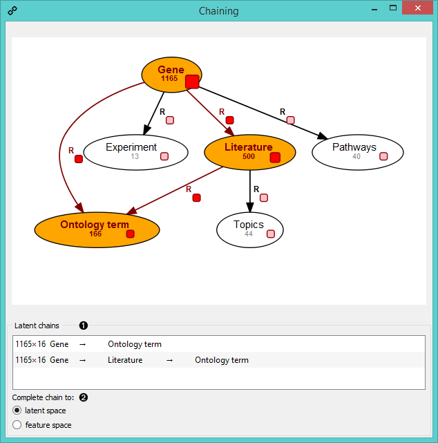

Chaining
========

Profiles objects of one type in the feature space of another type through chaining of latent factors.

Signals
-------

**Inputs**:

- **Fitted Fusion Graph**

  Fitted collective matrix.

**Outputs**:

- **Relation**

  Relations between two groups of objects.

Description
-----------

**Chaining** profiles links between latent factors, allowing the user to output
a particular latent chain. The widget displays a fitted fusion graph on the right,
where you can select the node for chaining.

1. By clicking on a node in the graph the widget will display latent chains. Click on the chain you wish to output.
2. Select what type of chain you wish to output:
   - **latent space** (widget will output chains between latent factors)
   - **feature space** (widget will output chains between features)

Example
-------

This widget is great for finding relation chains between data sets. In the example
below we have three data sets: ontology terms for genes, literature on genes and
literature on ontology terms. To see how genes are related to ontology terms through
literature, we use **Chaining**. The widget will display fusion graph, where you can
select the term you want to chain.

