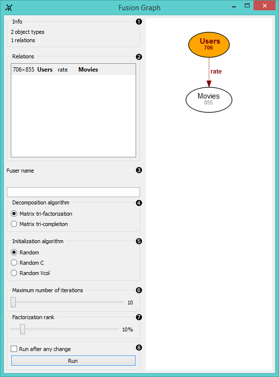

Fusion Graph
============

Constructs a data fusion graph and runs collective matrix factorization algorithm.

Signals
-------

**Inputs**:

- **Relation**

  Relationships between two groups of objects.  

**Outputs**:

- **Relation**

  Relationships between two groups of objects.

- **Fitted Fusion Graph**

  Fitted collective latent data model.
  
- **Fusion Graph**

  Input data system.

Description
-----------

**Fusion Graph** widget performs data fusion by collective matrix factorization. It fuses multiple 
related data sets into one comprehensive structure. The widget
returns a relational structure of the entire data system estimated by a collective latent factor
approach.

1. Information on the input (object types are nodes, relations are links between the nodes).
2. List of identified relations. Click on the relation to output it.
3. Specify a descriptive name for your fusion system.
4. Select the algorithm for [factorization](https://en.wikipedia.org/wiki/Non-negative_matrix_factorization):
   - **matrix tri-factorization** decomposes each relation matrix into three latent matrices and shares 
     the latent matrices between related data sets. Unknown values are imputed prior to collective factorization.
   - **matrix tri-completion** works the same as matrix tri-factorization, but does not require relation matrices
     to be fully observed.
5. Select the *initialization algorithm* for matrix factorization.
6. Set the *maximum number of iterations* used for factorization. Default is 10.
7. Set the *factorization rank* (the ratio of data compression based on the input data). Default is 10%.
8. If *Run after every change* is ticked, the widget will automatically commit changes. Alternatively press *Run*. 
  For large data sets we recommend to commit the changes manually.

Example
-------

The example below shows how to fuse several data sets together. Say we have the data on
[ontology terms for many genes](data-yeast/gene_annotations.tab), 
[literature on ontology terms](data-yeast/literature_go.tab) and 
[literature on genes](data-yeast/gene_literature.tab).
To fuse these data together we first use **Table to Relation** widget, where we manually set
the object type and relation names. **Fusion Graph** will compile the fusion graph of our three data sets with
connections between object types based on previously defined data relations,
display the connections and run matrix decomposition algorithm.

