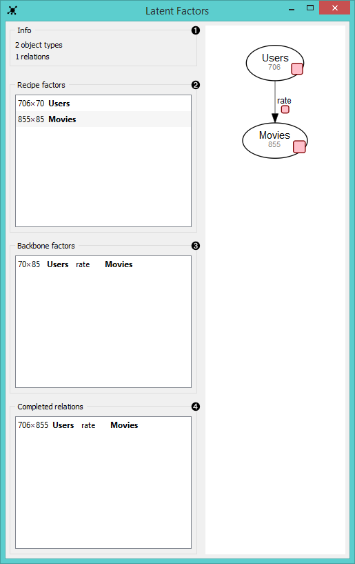

Latent Factors
==============

Draws data fusion graph with latent factors. Outputs latent factors for further analysis.

Signals
-------

**Inputs**:

- **Fitted fusion graph**

  Fitted collective matrix.

**Outputs**:

- **Relation**

  Relations between two groups of objects.

Description
-----------

**Latent Factors** widget displays relations between latent factors from the matrix
decomposition and arranges groups these factors by function. 

Fused data from the widget input are decomposed into latent factors, which
serve as components for subsequent matrix reconstruction. You would normally
draw this widget from **Fusion Graph** and feed it into other visualization
widgets, such as **Hierarchial Clusterin** or **Heat Map**.

1. Information on the input (object types are nodes, relations are links between the nodes).
2. A list of **recipe factors** (compressed matrix of the object type).
3. A list of **backbone factors** (interactions between latent components).
4. A list of **completed relations** (full relation matrix).

Example
-------

In the example below we demonstrate how 8 separate [yeast](data-yeast) 
data sets are fused together in **Fusion Graph** and then decomposed 
into latent factors with **Latent Factors** widget.

