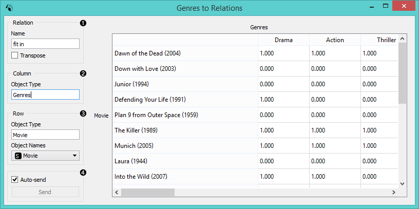

Table to Relation
=================

Converts a data table into a relation matrix. Labels objects in rows and columns of a relation matrix.

Signals
-------

**Inputs**:

- **Data**

  Attribute-valued data set.

**Outputs**:

- **Relation**

  Relationships between two groups of objects.

Description
-----------

**Table to Relation** widget is probably the most often used widget in the data fusion set.
It allows you to define relations just by labeling the axes. Your data set from the **File** widget 
will be transformed into a relation matrix, which can be later fused together with other relation
matrices into a collective latent data model.

1. Provide a descriptive name for the relation. Option [*transpose*](https://en.wikipedia.org/wiki/Transpose)
   will shift the axes.
2. Label the object type in columns. Your entry will be displayed on top of the table. Note that the labels
   are case-sensitive.
3. Label the object type in rows. If there is a label present in the data, it will be used as default.
4. If *Auto send* is ticked, your changes will be communicated automatically. Alternatively click *Send*.

Example
-------

In the example below we took two regular files with data on movie ratings and movie genres
and fed them into separate **Table to Relation** widgets. In these widgets we specified the relations
contained in the data and named the axes accordingly. See how **Fusion Graph** is then able to organize data
sets into a relational graph, i.e. a data fusion graph, simply on the basis of axes names?

